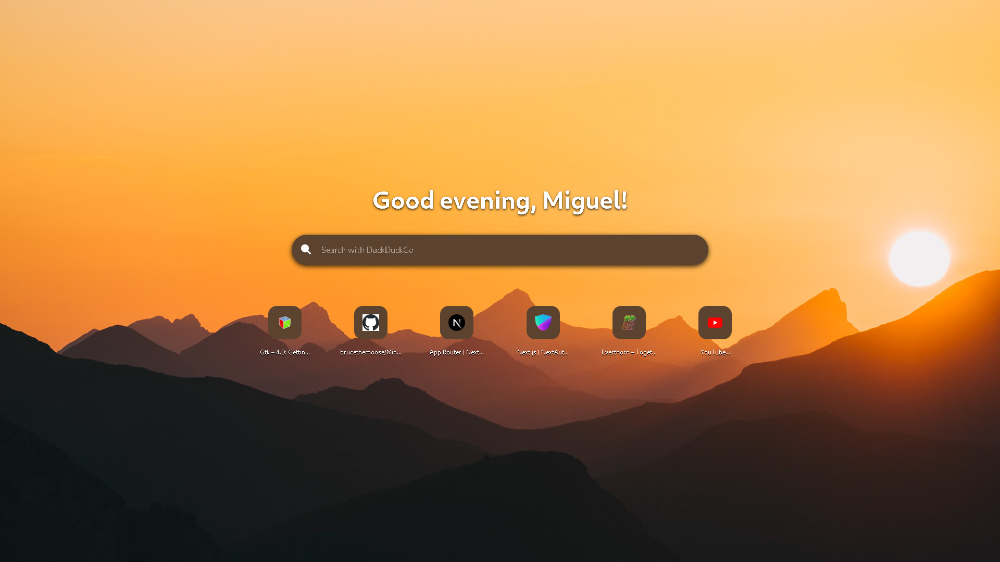
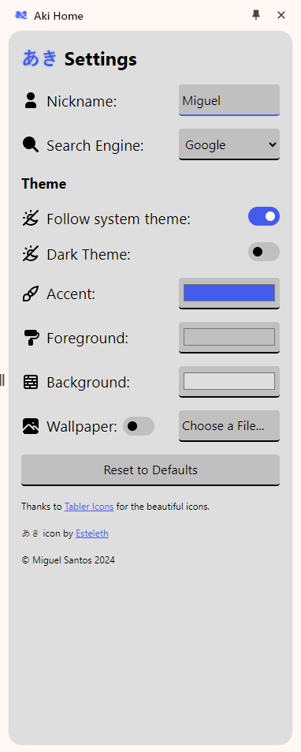
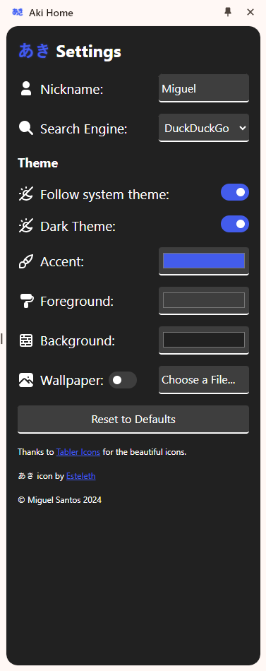

# Aki Home

A better version of OreoSearchPage, now in extension form!

Aki Home is a rework of [OreoSearchPage](https://cakephone.github.io/OreoSearchPage/) as a Chrome Extension (for now).

## Why make it an extension?

I've experienced long wait times for OreoSearchPage to load. Making it an extension just makes it work so much better. I not only took the chance to rebrand it, but to also integrate it with the browser, no longer leaving users to manually enter their bookmarks.

## Why Aki?

Aki (あき) is a Japanese name meaning "Clean", "Clear", "Simple", etc. Which is what I was aiming for with it. A simple, customisable and clean home that greets you every time you open your browser.

# Installation

- Clone this repository and move it somewhere safe, that's where the extension will be loaded from.

- Go to `chrome://extensions`.

- Make sure to enable Developer Mode at the top right corner.

- Load Unpacked.

- Locate the folder of the repo and select it.

- Done! Enjoy Aki Home!

## Updating

- `cd /path/to/extension/`

- `git pull origin main`

## Migrating your data from previous versions

The extension has got you covered, but make sure that you make a backup of it if you're comming from V1.0

### How to backup

- Open the popup/side panel

- Right click it

- Inspect

- Application

- Local Storage

- Copy the contents of the entry named `config`

- Save it somewhere where you'll remember

## Configuring

Click on the extension icon and the Side Panel will open for all the configuration you need!

 

All changes will be immediatelly reflected onto the page and Side Panel!

### Heads up! There's different themes!

Toggling Dark Mode will now show the configuration for it. Make sure you're editing the theme you ACTUALLY want to change by toggling it.

Different themes have independant:

- Theme colors

- Wallpaper

- Wallpaper toggle

# Roadmap

- [ ] Tint text
- [ ] Firefox Support
- [ ] Custom CSS
- [ ] Custom Animation Equation
- [ ] Export/Import config tool
- [x] ~~Auto Update Page and Popup~~
